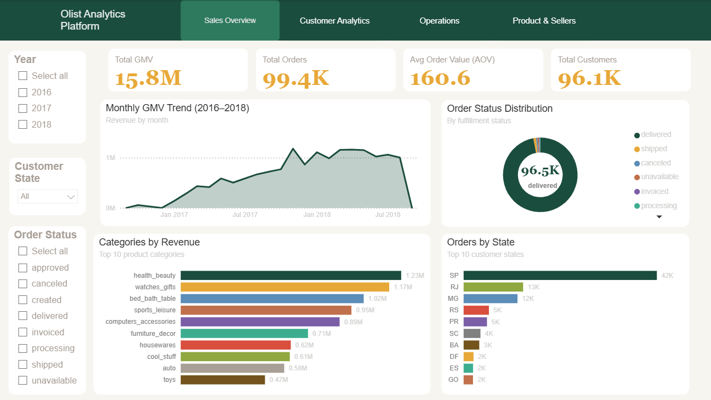
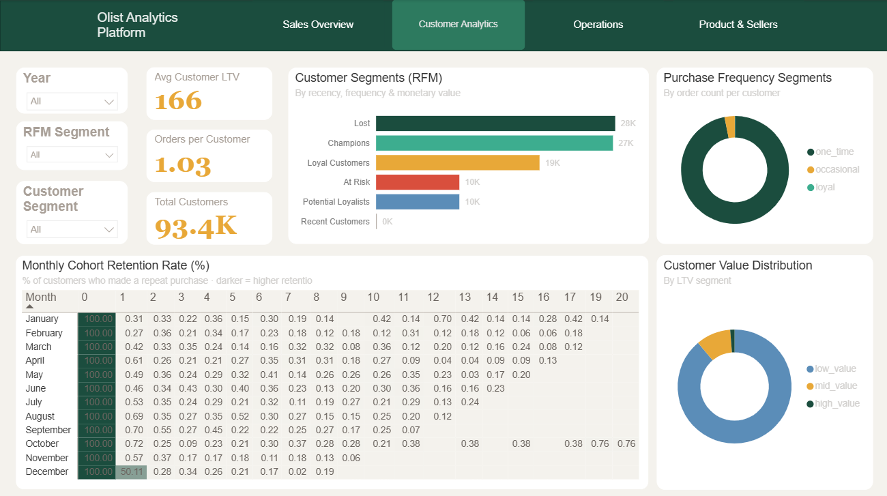
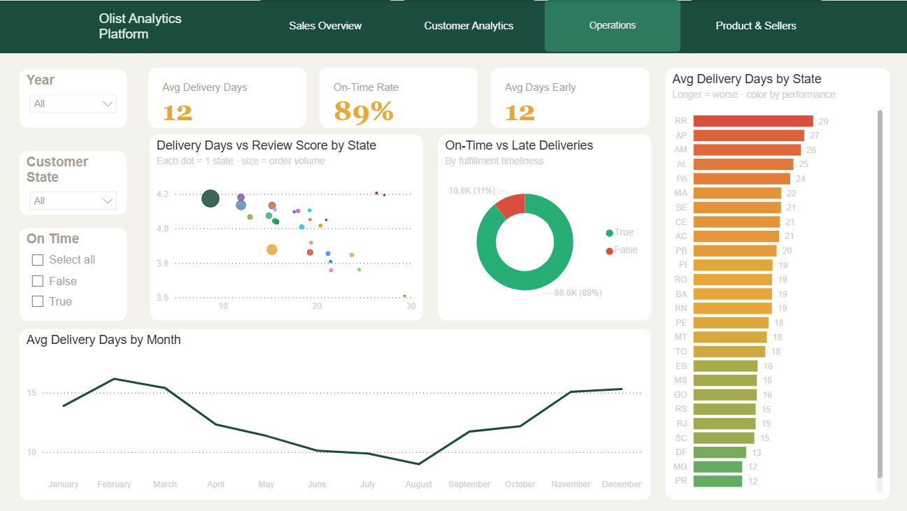
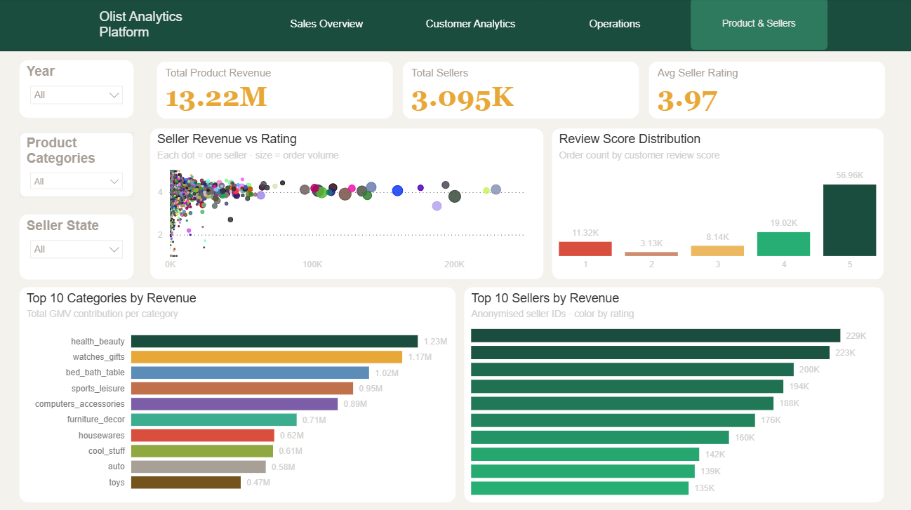

# Olist E-Commerce Analytics Platform

An end-to-end analytics engineering project built on the **Modern Data Stack**, 
transforming 1.5M+ rows of raw Brazilian e-commerce data into actionable business insights.

---

## Tech Stack

| Layer | Tool |
|---|---|
| Data Source | Kaggle (Olist Brazilian E-Commerce Dataset) |
| Ingestion | Python, Snowflake Connector |
| Data Warehouse | Snowflake |
| Transformation | dbt Core |
| Orchestration | GitHub Actions (CI/CD) |
| Visualization | Power BI |

---

## Architecture

**Pipeline Flow**
```
Kaggle API
    ↓
Python (ingestion)
    ↓
Snowflake — RAW schema
    ↓
dbt Core (Staging → Intermediate → Marts)
    ↓
Snowflake — MARTS schema
    ↓
Power BI Dashboard

Orchestration: GitHub Actions (triggered on every push to main)
```

### Data Flow
1. **Ingestion**: Python script downloads 9 CSV files via Kaggle API and loads them into Snowflake RAW schema
2. **Transformation**: dbt models transform raw data through 3 layers (Staging → Intermediate → Marts)
3. **Orchestration**: GitHub Actions runs `dbt build` on every push to main and supports manual triggers via `workflow_dispatch`
4. **Visualization**: Power BI imports data from Snowflake MARTS schema, delivering insights across 4 dashboard pages

---

## Data Model

### dbt Layers (18 models, 30 tests)

**Staging (8 views)** — type casting, column renaming, null handling
- `stg_orders`, `stg_customers`, `stg_order_items`, `stg_order_payments`
- `stg_order_reviews`, `stg_products`, `stg_sellers`, `stg_category_translation`

**Intermediate (4 views)** — business logic, joins, aggregations
- `int_orders_enriched` — joins orders, items, payments; calculates delivery metrics
- `int_customer_orders` — customer-level LTV, frequency, lifespan
- `int_delivery_metrics` — delivery time buckets and delay categories
- `int_product_revenue` — product revenue aggregated by month

**Marts (6 tables)** — Star Schema, BI-ready
- `fact_orders` — 99,441 rows, core transaction fact table
- `dim_customers` — 96,096 unique customers with segments
- `dim_products` — 32,951 products with English category names
- `dim_sellers` — 3,095 sellers with revenue and rating metrics
- `mart_cohort_retention` — monthly cohort retention matrix
- `mart_rfm_segments` — 93,358 customers scored by Recency, Frequency, Monetary value

---

## Dashboard

4-page Power BI dashboard covering:

| Page | Key Metrics |
|---|---|
| Sales Overview | GMV $15.8M, 99.4K orders, AOV $160.6, monthly trend |
| Customer Analytics | Cohort retention matrix, RFM segmentation, LTV distribution |
| Operations | 89% on-time rate, avg 12 days early, delivery performance by state |
| Product & Sellers | Top categories, seller performance, review score distribution |






---

## Key Business Insights

1. **GMV grew ~10x in 18 months** — from near zero in late 2016 to over $1M/month by early 2018, driven by rapid platform expansion across Brazil

2. **96.9% of customers are one-time buyers** — cohort retention drops below 1% after month 0, indicating the platform relies heavily on new customer acquisition rather than retention

3. **Delivery time strongly correlates with review score** — states with 25+ day delivery times (RR, AP, AM) show consistently lower ratings. Orders arrive on average 12 days earlier than estimated, suggesting Olist sets conservative delivery windows to manage customer expectations, contributing to the 89% on-time rate.

4. **Health & Beauty dominates revenue** — top category at $1.23M, nearly 2x the second-ranked Watches & Gifts ($1.17M)

---

## Project Structure
```
olist-analytics-platform/
├── ingestion/
│   ├── download_data.py
│   └── load_to_snowflake.py
├── dbt_project/
│   └── olist_dbt/
│       ├── models/
│       │   ├── staging/
│       │   ├── intermediate/
│       │   └── marts/
│       ├── macros/
│       └── dbt_project.yml
├── .github/
│   └── workflows/
│       └── dbt_pipeline.yml
├── dashboards/
│   ├── olist_analytics_dashboard.pbix
│   └── screenshots/
├── notebooks/
├── requirements.txt
└── README.md
```

## Setup & Reproduction

### Prerequisites
- Python 3.11+
- Snowflake account (free trial available)
- dbt Core (`pip install dbt-snowflake`)
- Kaggle account + API key

### Steps

**1. Clone the repository**
```bash
git clone https://github.com/TaoZ-data/olist-analytics-platform.git
cd olist-analytics-platform
```

**2. Set up environment**
```bash
python -m venv venv
venv\Scripts\activate        # Windows
pip install -r requirements.txt
```

**3. Configure credentials**
```bash
cp .env.example .env
# Fill in your Snowflake and Kaggle credentials
```

**4. Run ingestion**
```bash
python ingestion/download_data.py
python ingestion/load_to_snowflake.py
```

**5. Run dbt**
```bash
cd dbt_project/olist_dbt
dbt run
dbt test
```

---

## Dataset

[Brazilian E-Commerce Public Dataset by Olist](https://www.kaggle.com/datasets/olistbr/brazilian-ecommerce) — Kaggle

| Table | Rows |
|---|---|
| Orders | 99,441 |
| Customers | 99,441 |
| Order Items | 112,650 |
| Order Payments | 103,886 |
| Order Reviews | 99,224 |
| Products | 32,951 |
| Sellers | 3,095 |
| **Total** | **1,550,922** |

---

*Built by [Tao Zhang](https://github.com/TaoZ-data)*
